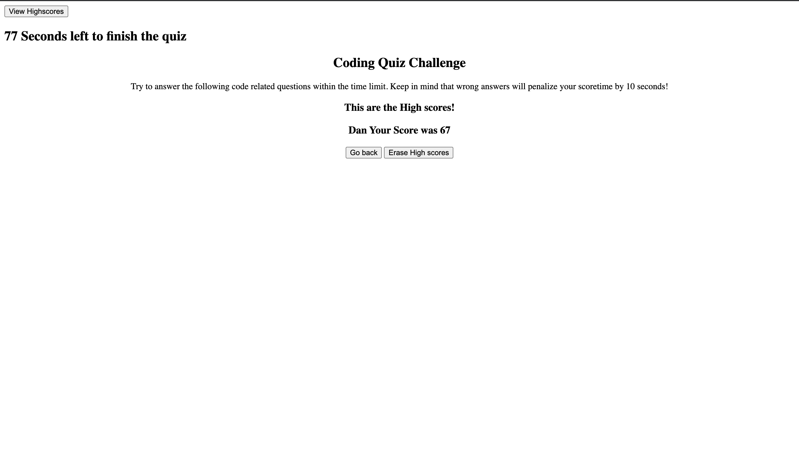

# Code-Quiz
This Code-Quiz was created with mainly Javascript, the idea is that the User try to answer the question in the best time possible, saving the score based on the time that it was needed to solve the quiz.

If the User has a wrong answer, the Quiz will deduct 10 seconds to the overall time, and when the quiz is completed, the User will be able to put his name and save the score in the server.

If the user wants to play again, the page will reload by clicking the button "Go back" and the scores can be deleted by clicking the "Erase High scores" button.

This is a first attemp to make the Quiz, the code needs some work to make it more comfortable to the view of the User, but the works and can be used.

The code that was written for the Index.html, is really short, most of the information displayed is created when the user interacts with the page.

